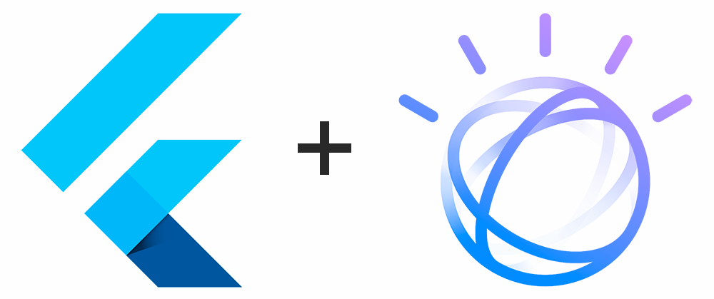

# Aplicación Móvil implementando la API de Watson Assistant V2 

> <p>Para plataformas iOS y Android  </p>

El servicio IBM Watson ™ Assistant combina aprendizaje automático, comprensión del lenguaje natural y un editor de diálogo integrado para crear flujos de conversación entre sus aplicaciones y sus usuarios.

La API Assistant v2 proporciona métodos de tiempo de ejecución que su aplicación cliente puede usar para enviar la entrada del usuario a un asistente y recibir una respuesta.

[Watson Assistant V2 API Reference](https://cloud.ibm.com/apidocs/assistant/assistant-v2)

## Descargar aplicación 📥

Click [aquí]() para descargar el APK.
> Para ejecutar en iOS se debe compilar directamente al iPhone en Sistema Operativo macOS.

## Para desarrolladores

Para implementar el código de la aplicación contacta con uno de los colaboradores de este repositorio para solicitar el ApiKey de Watson Assistant, y posteriormente llenar los parámetros en el archivo [watson_helper.dart](lib/data/watson_helper.dart):

```dart
final _waCredentials = WAConfig(
    version: "2020-02-05",
    apiKey: "",
    url: "",
    assistantID: "");
```

> Contacto: [Ricardo Niño](https://www.linkedin.com/in/ricardonino/)

## Licencia

    Licensed under the Apache License, Version 2.0 (the "License");
    you may not use this file except in compliance with the License.
    You may obtain a copy of the License at

      http://www.apache.org/licenses/LICENSE-2.0

    Unless required by applicable law or agreed to in writing, software
    distributed under the License is distributed on an "AS IS" BASIS,
    WITHOUT WARRANTIES OR CONDITIONS OF ANY KIND, either express or implied.
    See the License for the specific language governing permissions and
    limitations under the License.

### Aplicación desarrollada en Flutter

<p align="left">
  
</p>

For help getting started with Flutter, view our online [documentation](https://flutter.dev/).
